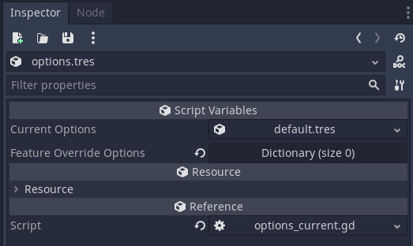

# Mod Loader Options

For easy configuration of the Mod Loader, you can use the ModLoaderOptions resource. 
Navigate to `res://addons/mod_loader/options` and double-click `options.tres` to open the resource editor.




## Available Options
| Option Name                        | Description                                                                                   |
|------------------------------------|-----------------------------------------------------------------------------------------------|
| enable_mods                        | Enable or disable loading of mods.                                                            |
| log_level                          | Set verbosity level for logs.                                                                 |
| locked_mods                        | List of mods that cannot be disabled or enabled in a user profile.                            |
| disabled_mods                      | List of mods not loaded on game restart.                                                      |
| allow_modloader_autoloads_anywhere | If true, ModLoaderStore and ModLoader Autoloads do not have to be the first Autoloads         |
| steam_workshop_enabled             | If true, ModLoader loads mod ZIPs from Steam workshop directory instead of default.           |
| override_path_to_mods              | Overrides path from which mods are loaded (default: "res://mods").                            |
| override_path_to_configs           | Overrides path from which mod configurations are loaded (default: "res://configs").           |
| override_path_to_workshop          | Overrides path to Steam workshop directory, for loading mods from there (editor use).         |
| ignore_deprecated_errors           | If true, deprecated functions trigger warning instead of fatal error.                         |
| ignored_mod_names_in_log           | List of mods whose messages should be ignored in the log.                                     |


## Profiles
You can find predefined option profiles in `res://addons/mod_loader/options/profiles`. These resource files can be dragged and dropped into the value field of a specific feature flag entry.


You can create your own option profiles by saving a `ModLoaderOptionsProfile` resource. One way to do this is to duplicate one of the existing profiles:

Right-click -> Duplicate...


Give it a new name


Now you can edit it to your liking by double-clicking it in the file dialog


## Feature Override Options (Feature Tags)
!!! inline end abstract "Available since" 
    6.2.0

If you have a specific feature tag that should use different settings, you can set them as a key-value pair here. 
The most common use case is to use different settings when in the editor - using the `editor` tag - that's why it is 
already added as an override by default.

Another use case is managing multiple release platforms - Steam and others. 
In that case, you would define a custom feature tag for steam, add it as override and enable steam workshop in the 
corresponding options. Of course, you can also use steam workshop as default and disable it otherwise.

To add another override, add a new entry to the dictionary.
- Select `String` as type for the key and enter one of [Godot's feature tags](https://docs.godotengine.org/en/3.5/tutorials/export/feature_tags.html) or one you have defined yourself.
- Select `Resource` as type for the value and drag one of the available `ModLoaderOptionsProfile` resources into the field.

!!! warning "Be careful with overlapping feature tags."

     Since dictionaries are not ordered, we cannot guarantee the order of two overrides being applied. 
     If, for example both "Windows" and "release" define an override, the result is not predictable on platforms where both tags apply.

## Game Version Validation

!!! inline end abstract "Available since" 
    7.1.0

There are multiple ways to validate that a mod is compatible with your current game version. The most common and easiest
method - apart from disabling version checks - is to follow [Semantic Versioning](https://semver.org/) (1). 
The mod loader will automatically disable mods when you increase the MAJOR version and disallow turning them 
on until the mod creator updated it. This reduces crashes when you make big changes to your game which will likely
break many mods. When you increase the MINOR version, the mod loader will disable mods on first launch, but still allow 
players to manually enable them again at their own risk.
{ .annotate }

1. Versions following the format MAJOR.MINOR.PATCH, i.e. 3.4.1

If that is not an option for you, you can still benefit from version validation by writing custom validation logic.

Set the `customize_script_path` option to where you store your script and run your validation here - the full 
`ModLoaderOptionsProfile` will be passed to this script instance. Though keep in mind that since validation 
is run during `#!gd2 _init()`, some values may not be accessible, so we recommend storing your game version in a 
global class or similar.

Example:

=== "Godot 4"

    ```gdscript2
    extends RefCounted
    
    # This is an example script for the ModLoaderOptionsProfile `customize_script_path`.
    # Ideally, place this script outside the `mod_loader` directory to simplify the update process.
    
    # This script is loaded after `mod_loader_store.ml_options` has been initialized.
    # It receives `ml_options` as an argument, allowing you to apply settings
    # that cannot be configured through the editor UI.
    func _init(ml_options: ModLoaderOptionsProfile) -> void:
        # Use OS.has_feature() to apply changes only for specific platforms,
        # or create multiple customization scripts and set their paths accordingly in the option profiles.
        if OS.has_feature("Steam"):
            pass
        elif OS.has_feature("Epic"):
            pass
        else:
            # Set `custom_game_version_validation_callable` to use a custom validation function.
            ml_options.custom_game_version_validation_callable = custom_is_game_version_compatible
    
    # Custom validation function
    # See `ModManifest._is_game_version_compatible()` for the default validation logic.
    func custom_is_game_version_compatible(manifest: ModManifest) -> bool:
        print("! ☞ﾟヮﾟ)☞ CUSTOM VALIDATION HERE ☜ﾟヮﾟ☜) !")
    
        var mod_id := manifest.get_mod_id()
    
        for version in manifest.compatible_game_version:
            if not version == "pizza":
                # Push a warning message displayed after manifest validation is complete.
                manifest.validation_messages_warning.push_back(
                    "The mod \"%s\" may not be compatible with the current game version.
                    Enable at your own risk. (Current game version: %s, mod compatible with game versions: %s)" %
                    [mod_id, "MyGlobalVars.MyGameVersion", manifest.compatible_game_version]
                )
                return true
    
            if not version == "pineapple":
                # Push an error message displayed after manifest validation is complete.
                manifest.validation_messages_error.push_back(
                    "The mod \"%s\" is incompatible with the current game version.
                    (Current game version: %s, mod compatible with game versions: %s)" %
                    [mod_id, "MyGlobalVars.MyGameVersion", manifest.compatible_game_version]
                )
                return false
    
        return true
    ```

=== "Godot 3"

    !!! warning
        This feature does not exist in Godot 3

