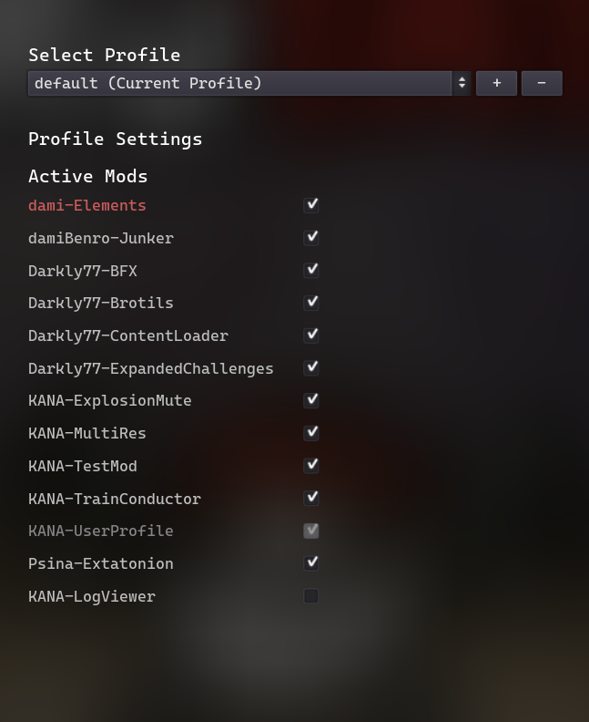

# Mod User Profiles

## Overview

User profiles allow users to create presets that define which mods are active and how they are configured.

## Data Storage

!!! note
	You do not need to manually handle data saving. This is managed by the [ModLoaderUserProfile API](../../api/mod_loader_user_profile.md).

User profiles are stored in the user's directory in the `mod_user_profiles.json` file.

### File Structure

```
current_profile
profiles
├── profileName
│   └── mod_list
│       └── mod-id
│           ├── current_config
│           ├── is_active
│           └── zip_path
└── profileName
    └── [...]
```

### Example `mod_user_profiles.json`

```json
{
	"current_profile": "default",
	"profiles": {
		"default": {
			"mod_list": {
				"GodotModding-UserProfile": {
					"current_config": "default",
					"is_active": true,
					"zip_path": "C:/Path/To/Your/Game/mods/GodotModding-UserProfile.zip"
				},
				"GodotModding-TEST01": {
					"is_active": true,
					"zip_path": ""
				},
				"GodotModding-TESTHOOKS": {
					"is_active": true,
					"zip_path": ""
				}
			}
		}
	}
}
```

## Quickstart

### Example Interface

If you plan to use the profile and [mod config](../modding/config_json.md) features, we recommend integrating profile and config management directly into your game. This ensures a seamless experience for players when managing their mods.

A good starting point is the [**User Profile UI Mod**](https://github.com/GodotModding/GodotModding-UserProfileUI), which you can use as a base to build your own implementation:


