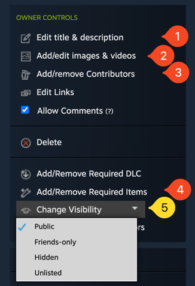

# Distributing Mods

A finished mod ready for distribution is just a `.zip` file which you can share with others. Where it is shared
specifically depends on the game and modding community. For Steam games with official support, Steam workshop is
a common place. For the rest, Thunderstore is a good option.

## Exporting

The first step to distribution is exporting your mod. You can make this zip manually, but if you have
custom assets it may get quite involved. In any case, you need to follow the [zip structure](mod_structure.md#zips).

Exporting is a lot simpler if you use the [mod tool plugin to export](tools/mod_tool.md#exporting) since it does
all those steps automagically.

## Distribution

You can technically just share your mod zip with anyone through any means, but there are better ways.

### Steam

First, [quickly test](testing_debugging.md#quick-steam-workshop-test) your mod as if it were in the steam workshop.
Then you can use the [workshop uploader](tools/workshop_uploader.md) to get your mod on the workshop.

Once uploaded, the item will be private by default, you can change this in the right sidebar under "visibility" (5).

If your mod has [dependencies](using_other_mods.md), you can add other steam workshop items which will automatically be downloaded when your
mod is downloaded, by adding "Required items" (4).

{ .half-width .center }

You can add additional images and description from the steam interface under "edit title and description" (1) and
"add images" (2).
The item icon/preview image can only be changed with a new upload.
Note that the title will be overwritten with the mod id when you upload a new version. This is a quirk of the
workshop uploader.

If you want to allow others in your team to make edits to the workshop item, you can "add contributors" (3) from your
Steam friends list.
