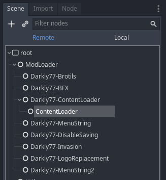

# Global Classes & Child Nodes
This page covers advanced techniques for mod making.

## Global Classes
ModLoader can't support global classes, because they're registered in a settings file stored inside the binary itself. 
This means that you can't expose a global class for other dependent mods to use. However, you can work around this 
limitation by exposing the class as a child node (see below).


## Child Nodes
When your mod is initialised it's added as a child to the ModLoader node (shown left). You can also add additional child 
nodes to your mod's node if you wish (shown right):

<div class="grid cards" markdown>

- 
- 

</div>

This lets you make custom classes available to other mods.


## Example
Example for adding a child node in `mod_main.gd`. This particular example comes from Brotato's [ContentLoader](https://github.com/BrotatoMods/Brotato-ContentLoader) mod:
```gdscript
# Add to your mod's `_init` in mod_main.gd
func _add_child_class():
	var ContentLoader = load("res://mods-unpacked/Darkly77-ContentLoader/content_loader.gd").new()
	ContentLoader.name = "ContentLoader"
	add_child(ContentLoader)
```

To use this in a different mod:
```gdscript
# Get the class
var ContentLoader = get_node("/root/ModLoader/Darkly77-ContentLoader/ContentLoader")

# Use a method from the class
ContentLoader.load_data()
```