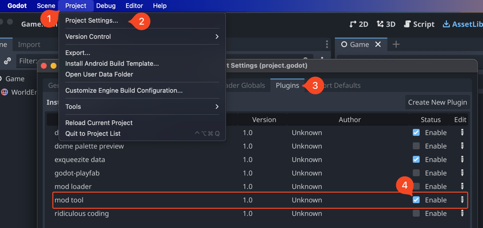
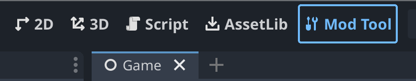
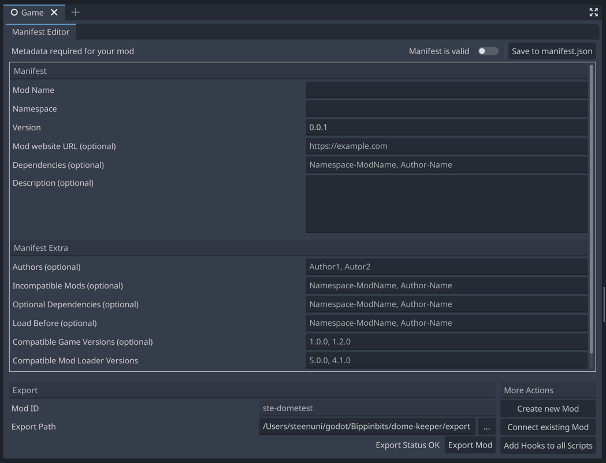
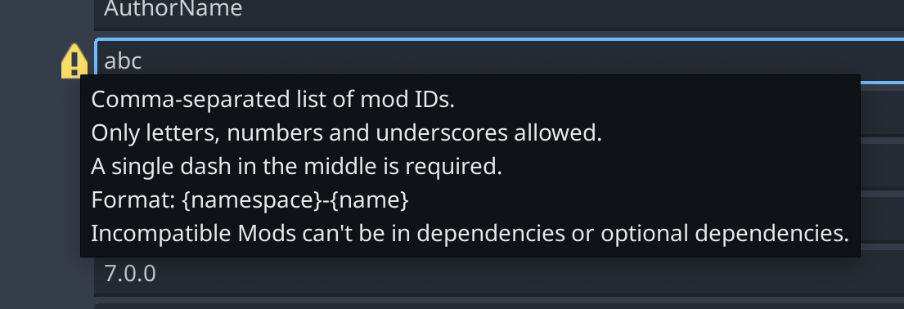
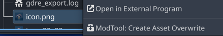
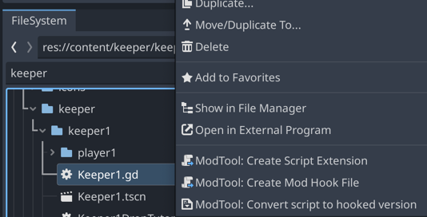

# The Mod Loader Mod Development Tool

The Mod Tool or Dev Tool is a plugin we made for the Godot Editor to make various modding tasks easier.

## Installation

Some games, like Dome Keeper, already have the mod tool installed, but not activated. In that case you can skip past
the download section. 

See: [Godot Docs: Plugin Installation](https://docs.godotengine.org/en/stable/tutorials/plugins/editor/installing_plugins.html)

Make sure to also enable the mod tool in the project settings 
(top bar > Project > Project settings... > Plugins tab > mod tool > enable). 

Once activated, you will find a new "Mod Tool" button in the view selection bar at the top of the editor.

Pressing it will open the [main mod tool panel](#main-panel) for you.

Apart from the main panel, the mod tool also adds more modding-specific [context actions 
](#file-system-context-menu) to the file system dock.

!!! note
    Sometimes you may need to restart the editor after enabling the plugin.

## Main Panel

### Connecting your mod

Connecting your mod allows the dev tool to correctly place newly created files, edit the correct manifest, 
and export the correct mod once you are done.

In the lower right section of the panel, you can connect any mod that is currently in the `/mods-unpacked`
folder. 

If you don't have a mod yet, you can also create a new one here - it will ask you for the name
and namespace (explained in [mod files > manifest.json](../mod_files.md#manifestjson)) and will then create
a new mod folder with all the required files. 

### Manifest Editor

The manifest editor makes editing metadata a bit easier, you don't need to know how json works
or format it correctly, and you will get some editing hints when hovering over the input labels.

!!! tip
    When you've made your edits, don't forget to press the save button in the top right.

In case of errors, you can hover the icon and see why validation failed.

### Exporting

Exporting using the mod tool is very simple:

1. Choose an export path
    - this can be any folder or perhaps the [steam workshop folder](../file_paths.md#workshop-folder) for [quick tests](../testing_debugging.md#quick-steam-workshop-test)
2. Press the export button
3. And [test your mod](../testing_debugging.md) ;)

## File System Context Menu

The context menu appears when you right-click any files. Which extra context actions you 
will get depends on the file type. All mod tool actions have the prefix "Mod Tool" to make 
it easier to tell them apart from standard actions.

### Resource Actions

Most things you can save to file in Godot are Resources. Their job is to store data and provide
it for your code to use. The resource action is to create an [overwrite](../overwriting_game_resources.md), 
which allows you to replace vanilla files with modded files.

The action will place a copy of the Resource into your mod folder and add it to the 
[`overwrites.gd`](../overwriting_game_resources.md) file.

The most common Resources you probably want to change are images (`.png`, `.jpg`, `.svg`, ...) 
and audio (`.wav`, `.ogg`, ...).

### Script Actions

Scripts are the main thing we want to mod and there are two ways to mod them:
1. [Extensions](../script_extensions.md) - prefer these when possible
2. [Hooks](../script_hooks.md) - use them when a script has a `class_name` at the top

The "Create Script Extension" action simply creates a new script, correctly adds the vanilla `extends` 
path at the top, and finally adds the modded script path to your `mod_main.gd`. 

The "Create Mod Hook File" action is similar, just for hooks - it creates a new script that
extends `Object` and adds it to `mod_main.gd`.

The Convert action processes a script so that [hooks can be used in the editor](../script_hooks.md#hooks-in-the-editor)
Without this step, testing hooks can get cumbersome since you would always have to test
on the compiled game. Once converted, the action changes to an undo action, just in case you need to
go back to the original vanilla script.  
After convert and revert always save the file once to avoid accidentally converting the same script twice
(the godot editor doesn't really let us save to file properly after changing it.)

Yes, scripts are technically also Resources, but for our case there are better ways to change scripts 
than pure overwrites.

